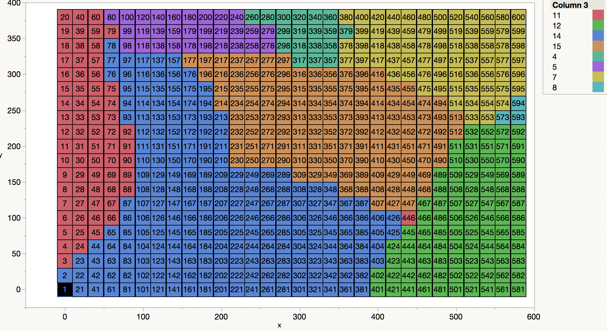

```{r setup, echo = FALSE, message=FALSE, warning=FALSE}
knitr::opts_chunk$set(
  collapse = TRUE,
  comment = "#>",
  cache = TRUE,
  echo = TRUE
)
```

```{r}
library(tidyverse)
library(mvpart)
# source("C:/Users/dora/Downloads/mvpart_1.1-1/mvpart/R/mvpart.R")
```

# Installation

The __mvpart__ package is no longer active on CRAN but can be installed from the archives.

```R
# install.packages("devtools")
devtools::install_github("cran/mvpart")
```

Or download a realease from https://github.com/cran/mvpart/releases and install it with something like:

```R
install.packages(
  "C:/Users/dora/Desktop/mvpart-1.6-2.tar.gz", 
  repos = NULL, type = "source"
)
```

Some people reported installation issues (https://goo.gl/oDjjz8).


# Data

- Tutorial https://goo.gl/zDLdMi
- Data from Stuart Davies (https://goo.gl/NszXEi).

```{r load-data, include=FALSE}
devtools::load_all()
KC3spp20 <- read_csv_alt("KC3spp20.csv", "./data-raw/mvpart/KC3spp20.csv")
kc.hab <- read_csv_alt("kc.hab.csv", "./data-raw/mvpart/kc.hab.csv")
```


## Overview data

2 files attached:

- KC3spp20 – is the species matrix of abundance in each of 600 quadrats

```{r}
# See a few columns from the beginning, middle and end
KC3spp20 %>% dplyr::select(1:2, 250:252, 583:585)

# For a cleaner output for interpretation, normalized tree spp data to a mean of
# 0 and standard deviation of 1 (https://goo.gl/zDLdMi).
```

- kc.hab – a bunch of habitat variables for the same 600 quadrats

```{r}
kc.hab %>% dplyr::glimpse()
```

# Results

In this section, we first explore one result in detail; then we'll re-run the exact same model twice more and we'll compare the results.

## Build and run the model

```{r, fig.height=14, fig.width=12}
abundance <- data.matrix(KC3spp20)
environmental_variables <- kc.hab

formula <- abundance ~ RB_NO3 + RB_NH4 + RB_PO4 + Al + pH_water + Na + Mn + 
  Mg + K + Fe + Ca + BS + ECEC + Bray_P + meanelev + convex + slope

# Set a new seed for random numbers to ensure results are reproducible
set.seed(1221)

# See `?mvpart()` for argument details
mvpart_run1 <- mvpart(
  form = formula, 
  data = environmental_variables,
  all.leaves = TRUE,  # annotate all nodes
  rsq = TRUE,  # give "rsq" plot
  pca = TRUE,  # plot PCA of group means and add species and site information
  wgt.ave.pca = TRUE  # plot weighted averages acorss sites for species
)
```

## Model details

### Structure

```{r}
str(mvpart_run1)
```

### Full summary

```{r}
summary(mvpart_run1)
```

### Groupings

```{r}
table( mvpart_run1$where)
```

### Map

Map produced by Stuart Davies.



# Evaluation

## Compare multiple runs of the same model

__Two runs of the same model are different because the algorithm uses random numbers.__

```{r compare-run, fig.height=14, fig.width=12}
set.seed(1234)  # Set a new seed for random numbers
mvpart_run2 <- mvpart(form = formula, data = environmental_variables)
# Set a different seed and re-run the exact same model
set.seed(4321)  
mvpart_run3 <- mvpart(form = formula, data = environmental_variables)
# compare all models run
all.equal(mvpart_run1, mvpart_run2)
all.equal(mvpart_run1, mvpart_run3)
all.equal(mvpart_run2, mvpart_run3)
```

## To follow up

```
The clustering actually is weird. It groups the top of the hill and the bottom
of the hill (red and green on the map) together in the second split. The
species are really different between these habitats, which suggests there is
an error.  It looks like the analysis just grouped on soils, and did not
consider species data.
```

```{r note-0153, eval=FALSE, include=FALSE}
# Davies, Stuart J. <DaviesS@si.edu> wrote:
# 
# I was just reading through some of the results and the paper on the technique.
# 
# ...
# 
# What did your command below do to the species data? KC3spp20 was already a
# matrix (of species * quadrat).
# 
# abundance <- data.matrix(KC3spp20)
# 
# what happens if you just run it a raw data? 
```

```
The classification tree seems to be entirely driven by the soils, and the
species don’t carry much weight. Perhaps standardizing the abundances would help?
```

```{r note-0179, eval=FALSE, include=FALSE}
# Davies, Stuart J. <DaviesS@si.edu>

# The classification tree seems to be entirely driven by the soils, and the
# species don’t carry much weight. Perhaps standardizing the abundances or
# something would help? My map of the 8 clusters is fine. It represents
# distinctly different habitats. But, the order of classification in the tree is
# weird.

# Any idea what determines the number of clusters?  Why 8?
```


- Are soils values much different than values of other environmental variables?

```{r}
kc.hab %>% 
  tidyr::gather(var, value) %>% 
  ggplot() + 
    geom_boxplot(aes(x = var, y = log(value))) +
    coord_flip()
```

```
I wonder if the results would differ after scaling the species data (“scale” function in base package). The data we used were just raw data.
```

> These are data for each tree species normalized to a mean of 0 and standard    deviation of 1, which creates a cleaner output for interpretation

--https://goo.gl/zDLdMi


> The value of scale determines how column scaling is performed (after 
centering). If scale is a numeric vector with length equal to the number of 
columns of x, then each column of x is divided by the corresponding value from 
scale. If scale is TRUE then scaling is done by dividing the (centered) columns 
of x by their standard deviations if center is TRUE, and the root mean square 
otherwise. If scale is FALSE, no scaling is done.


```{r, fig.height=14, fig.width=12}
abund_scaled <- KC3spp20 %>% data.matrix() %>% scale()
environmental_variables <- kc.hab

formula <- abund_scaled ~ RB_NO3 + RB_NH4 + RB_PO4 + Al + pH_water + Na + Mn + 
  Mg + K + Fe + Ca + BS + ECEC + Bray_P + meanelev + convex + slope

set.seed(1221)
mvpart_run1 <- mvpart(form = formula, data = environmental_variables)
```


- Why is this approach useful compared to other approaches (e.g. implemented in vegan)?

- Map with ggplot2


# Miscelaneas

## Package __rpart__ does not handle multi variate data

The __rpart__ package seems like a good alternative because `?mvpart::mvpart()` says it's a wrapper of `rpart()`. However, `mvpart::rpart()` works with multivariate data, but `rpart::rpart()` does not. 

```R
mvpart::rpart(form = formula, data = environmental_variables)  # passes
rpart::rpart(form = formula, data = environmental_variables)  # fails
```

__rpart__ is active but __mvpart__ is not. Maybe the authors can inform where else __mvpart__ functions can be found.

Access __rpart__'s vignettes from R with:

```R
browseVignettes("rpart")

# An Introduction to Recursive Partitioning Using the RPART Rutines (62 pages)
vignette("longintro")
```


# Learning more

- De'Ath, G. (2002). Multivariate regression trees: a new technique for modeling species–environment relationships. Ecology, 83(4), 1105-1117. 
    - https://goo.gl/w91WM3
