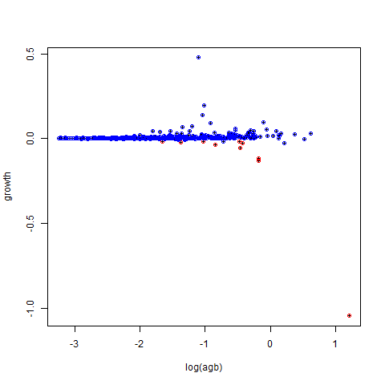

```{r setup, include=FALSE}
knitr::opts_chunk$set(
  comment = "#>",
  collapse = TRUE,
  fig.align = "center",
  fig.asp = 0.618,
  fig.width = 6,
  out.width = "75%",
  cache = TRUE,
  echo = FALSE 
)
library(ctfs)
library(knitr)
```

### `graph.outliers.spp()`

```{r, include=FALSE}
full <- extract.growthdata(
  census1 = bci::bci12full1,
  census2 = bci::bci12full2,
  growcol = 'incgr',
  growthfunc = growth.biomass.indiv,
  logit = 'x',
  rounddown = FALSE,
  mindbh = 100,
  dbhunit = 'mm',
  err.limit = 4000,
  maxgrow = 7500
)
trimmed <- extract.growthdata(
  census1 = bci::bci12full1,
  census2 = bci::bci12full2,
  growcol = 'incgr',
  growthfunc = growth.biomass.indiv,
  logit = 'x',
  rounddown = FALSE,
  mindbh = 100,
  dbhunit = 'mm',
  err.limit = 4,
  maxgrow = 75
)
png("actual_graph_outliers_spp.png")
  graph.outliers.spp(
    full,
    trimmed,
    spname = "gustsu",
    fit = NULL,
    size = "agb",
    export = NULL,
    xtitle = "log(agb)",
    ytitle = "growth"
  )
dev.off()
```

```{r fig.cap="Reference"}

```

```{r fig.cap="Actual"}

```

